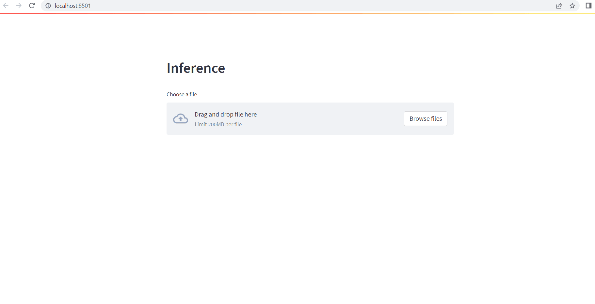

# ai-well-top-picker
 A ML based application for classifying top from well log data

 ## Setup

 1. Git clone this repo
    ```
    git clone 
    ```

2. Install prerequisite
    ```
    pip install -r requirements
    ```

## Run

1. Run the following command to launch the web apps:
    ```
    streamlit run app.py
    ```

    

## Train

1. Preprocess the well data
    ```
    python data_ingetion.py
    ```

2. Run the `ml_workflow.ipynb` to train a new model

